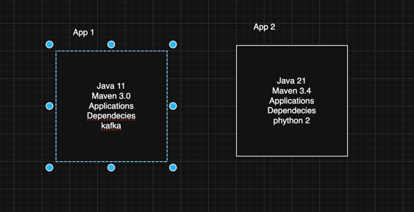

# DockerNotes
This aims to learn about docker and its implementations.

## Table of Content

- [What is Docker?](What is Docker)
- [What is Docker Container?] (What is Docker Container)
- [Installing Docker](What is Docker Container)
- [Docker Vs Virtual machine](What is Docker Container)
- [Docker Commands](What is Docker Container)
- [Debugging in Docker](What is Docker Container)
- [Deleting All docker Resources](What is Docker Container)
- [Building Docker Image](What is Docker Container)
- [Running Custom Docker Image](What is Docker Container)
- [Dockerizing Applications](What is Docker Container)

---

## What is Docker:
**Docker** -is a open-source containerization platform by which you can pack/bundle your application and all of its dependecies into a standardized unit called #Containers#

**Docker Image**- is a read-only template containing the software, libraries, other components needed to run a application.  

**Container**- is a running instance of a Docker image, providing a self-conatianed, isolated env for the application to execute.

**Docker Registry**-is a centralized storage for collecting and managing the docker images. eg: Like All maven plugins and librarier resides in maven repository, similarly all the images resides in Docker registry 
This docker registry can be Public or private as well.
Public registry- Docker Hub
Private resistry- Any private registry

**Docker Engine**- is a core part of Docker that handles the creation and management of containers.

**Docker Hub**- is a Cloud based reposirty that is used for finding and sharing the container images.

**Docker File**- is a file that describes the steps the create image quickly.

### Why Docker?
Suppose you are working in 2 application, both uses 2 diff tech stack, something like this:

you need to maintain all the software, dependencies related to these 2 application in your system.
This issue will easily resolved by Docker image and containers.
In actual prod en, you will ask Infra team to setup diff configuration for each deployement.
With Docker, you can provide the Docker image which can contain all the configuration related to different application and ask Infra team to just deploy.
These image can be reside in Docker Registry so can shared easily.

## Installing Docker 
Installtion is very simple & like any software installtion.
Docker Desktop : https://docs.docker.com/desktop/
Also, you need to create an account on Docker Hub. By this you can access many free repos and also can find your private registry there.

## Docker Vs Virtual machine
